<div align="center">


# 🏦 Our Bank – Modern Interactive Banking UI

**A premium, art-directed digital banking experience built with plain HTML, CSS and JavaScript.**
Registration, login, deposits, withdrawals and a live transaction ledger, wrapped in a token-driven design system with a vibrant violet and emerald light theme and a deep obsidian dark theme.

[](https://vitejs.dev)
[](#tech-stack--architecture)
[](#tech-stack--architecture)
[](#tech-stack--architecture)
[](#-dual-theme-engine)
[](#license)
[](#contributing)

[**Live Demo**](https://aaronstark1.github.io/ourbank-website/) · [**Quick Start**](#-quick-start) · [**Features**](#-key-features) · [**Architecture**](#tech-stack--architecture)

</div>

---

## 📸 Preview

<table>
  <tr>
    <th width="50%">Light theme</th>
    <th width="50%">Dark theme</th>
  </tr>
  <tr>
    <td>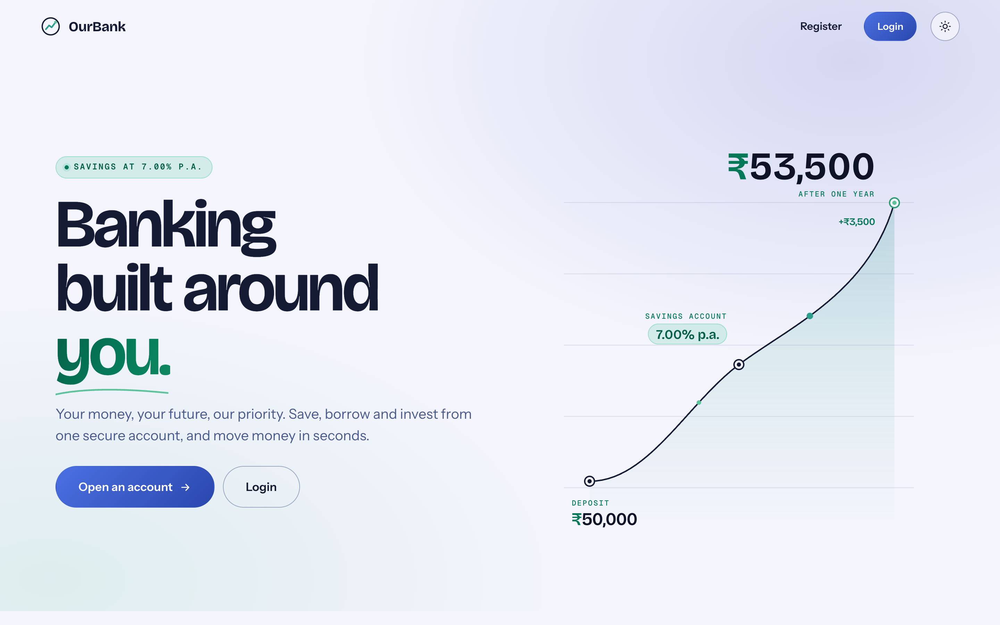</td>
    <td>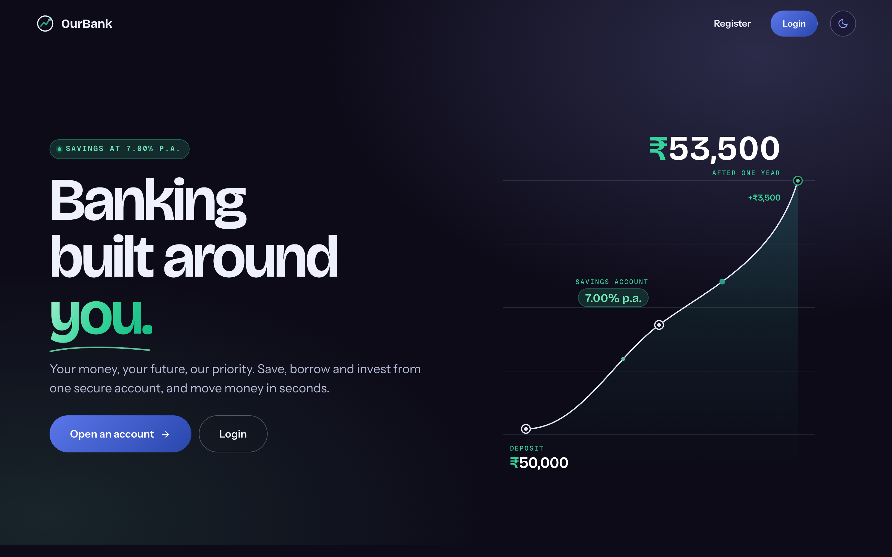</td>
  </tr>
  <tr>
    <th>Dashboard, withdraw preview (dark)</th>
    <th>Dashboard, balance and ledger chart (light)</th>
  </tr>
  <tr>
    <td>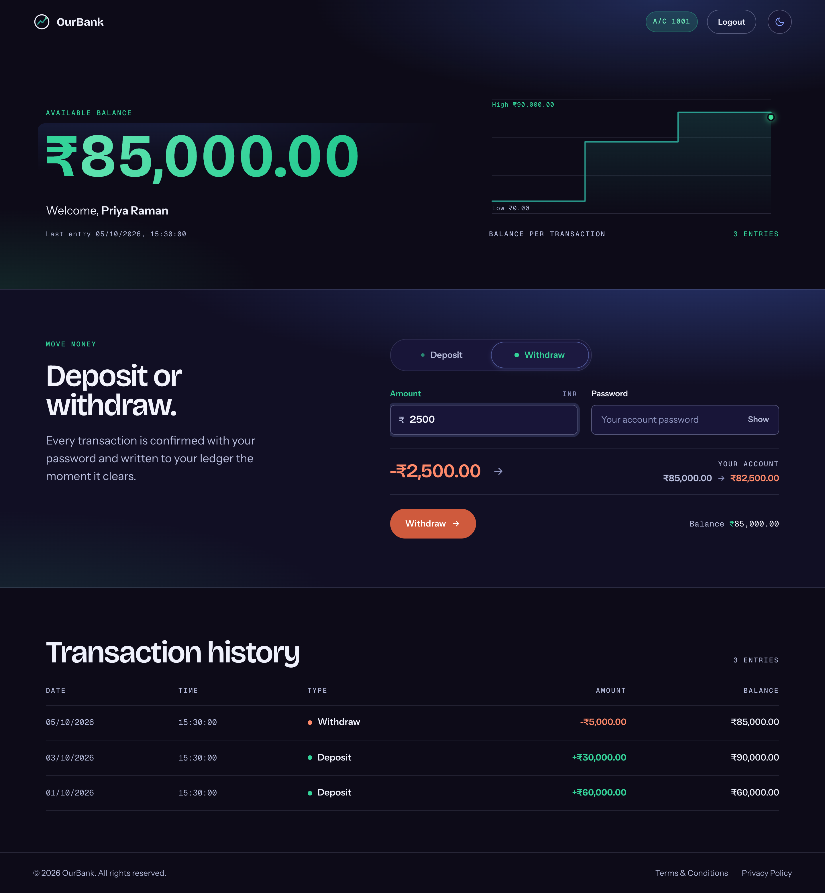</td>
    <td>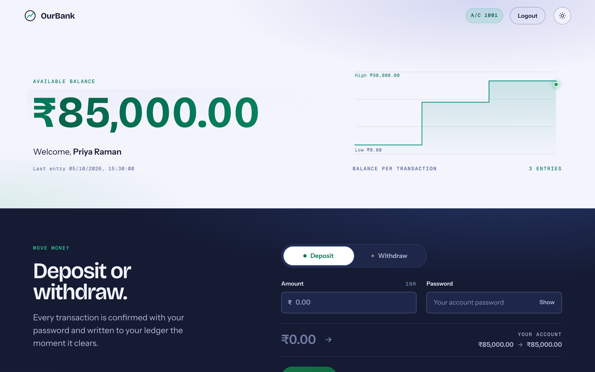</td>
  </tr>
  <tr>
    <th>Login</th>
    <th>Registration</th>
  </tr>
  <tr>
    <td>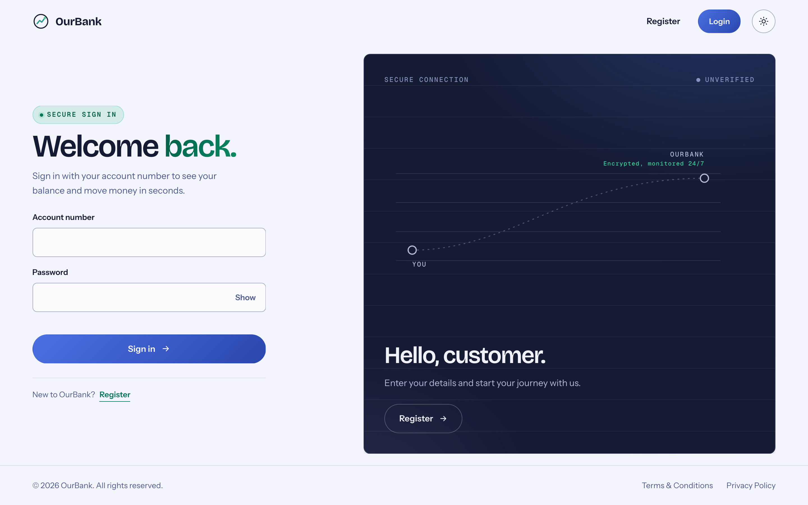</td>
    <td>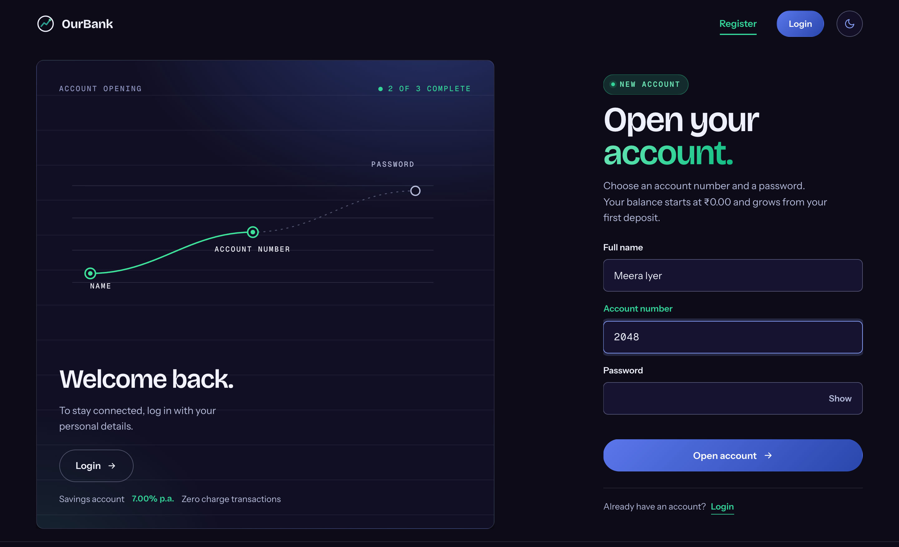</td>
  </tr>
</table>

<details>
<summary><strong>More views</strong>: full homepage, mobile, theme toggle</summary>
<br>
<table>
  <tr>
    <td width="34%" valign="top">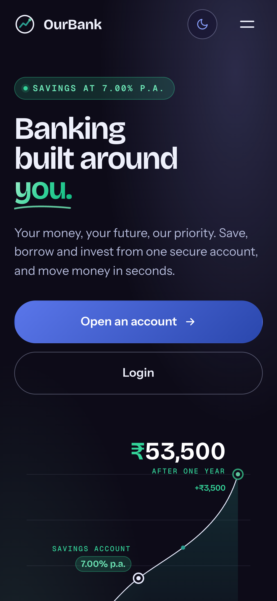</td>
    <td width="33%" valign="top">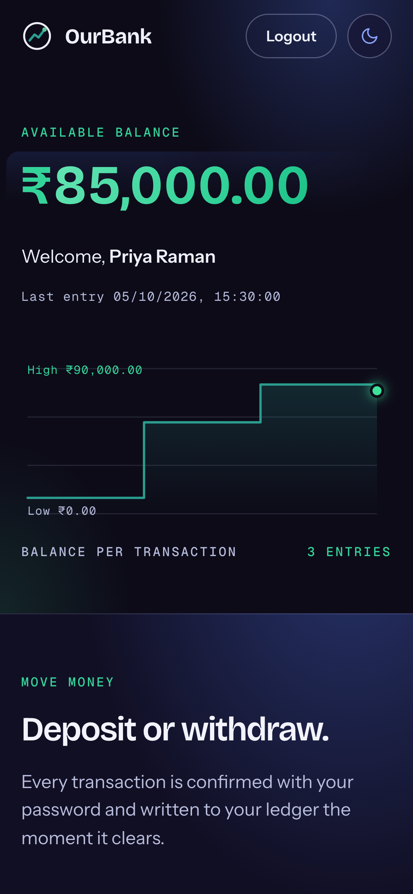</td>
    <td width="33%" valign="top">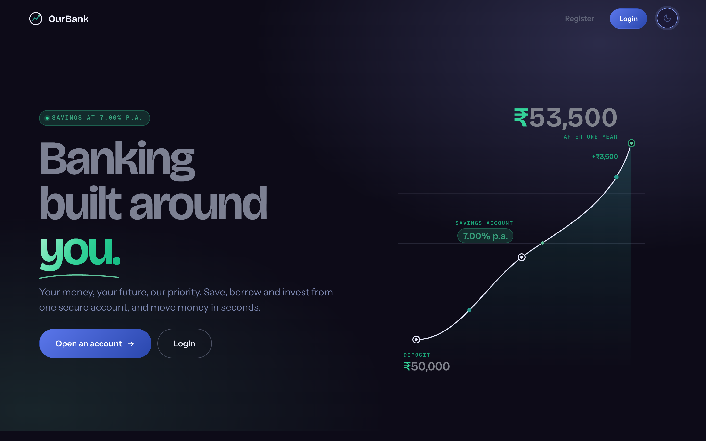</td>
  </tr>
</table>
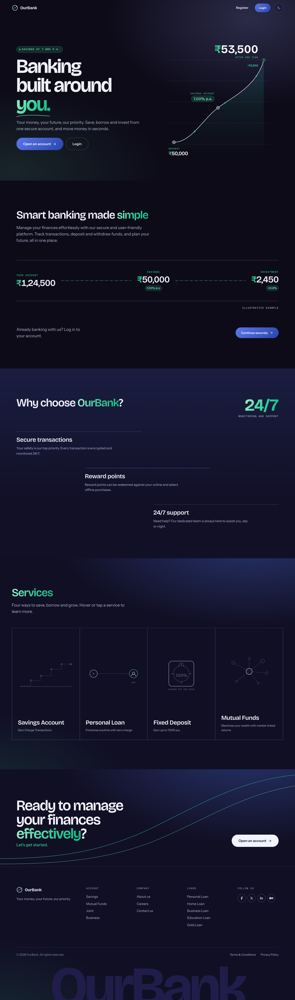
</details>

---

## ✨ Key Features

### 🌓 Dual Theme Engine
Instant, flicker-free switching between the vibrant violet and green light theme and the deep obsidian dark theme. A tiny bootstrap script sets `data-theme` on `<html>` before first paint, the choice persists in `localStorage`, and `prefers-color-scheme` is respected until the user picks a side. Every colour comes from one token file, so the sun / moon toggle changes nothing but variables.

### 💸 Real-Time Financial Operations
Deposit and withdraw from a segmented control that slides between forms. A live preview strip reads the real balance as you type (`₹85,000.00 → ₹82,500.00`), every transaction is confirmed with the account password, insufficient funds are rejected, and a successful transaction animates a pill from the form into the balance, counts the figure up or down, redraws the balance chart and slides the new ledger row in.

### 🌿 Fintech Typography
Bricolage Grotesque display type, Instrument Sans body text and Geist Mono for ledger data, with Indian-rupee grouping (`₹1,24,500.00`). Emerald and mint gradients carry the headline keywords, the balance figure and the growth metrics; currency signs, positive transactions and eyebrow badges use forest green on light surfaces and luminous mint on dark ones, all at WCAG AA contrast.

### 🔒 Client-Side State Persistence
A complete simulation of profiles and sessions with no backend. Accounts live in `sessionStorage` keyed by account number, the active session is a single `loggedInAccNo` flag, every transaction is appended to the account's history, and the theme choice lives in `localStorage`.

### Also in the box
- Choreographed motion: masked headline reveals, SVG path drawing, pointer parallax in the hero, scroll-driven exits, counters, all honouring `prefers-reduced-motion`.
- One continuous "ledger line" motif: the growth curve in the hero, the transfer track, the services visuals, the secure-connection line on login, the account-opening steps on registration and the balance chart on the dashboard.
- Accessible by default: semantic landmarks, labelled inputs, visible focus states, keyboard-operable service strips and tabs, a skip link, and no horizontal overflow from 390px up.

---

## Tech Stack & Architecture

<div align="center">


</div>

No framework, no build step required to run: Vite is used only as a fast dev server. All state is client-side and all styling flows through CSS custom properties.

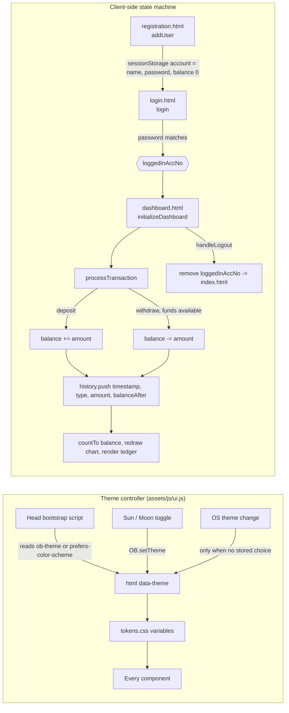

---

## 📁 Project Structure

```text
ourbank-website/
├── index.html              Landing: hero, money movement, why OurBank, services, footer
├── login.html              Sign in with the secure-connection visual
├── registration.html       Open an account with the account-opening steps
├── dashboard.html          Balance, deposit / withdraw, transaction history
├── assets/
│   ├── css/
│   │   ├── tokens.css      Design tokens: light + dark palettes, type scale, motion
│   │   ├── base.css        Reset, typography, buttons, forms, nav, footer, reveals, toggle
│   │   ├── home.css        Homepage sections and financial visualisations
│   │   ├── auth.css        Login and registration layouts and panels
│   │   └── dashboard.css   Dashboard ledger, actions and history
│   ├── js/
│   │   ├── ui.js           Shared: theme engine, nav, reveals, counters, toasts
│   │   ├── home.js         Hero choreography and services interactions
│   │   ├── auth.js         login() and addUser() with inline feedback
│   │   └── dashboard.js    Banking logic, balance chart, transaction feedback
│   └── screenshots/        README previews
├── package.json            Vite dev server scripts
└── images/, index.css, footer/   Legacy assets from the previous design (unreferenced)
```

---

## 🚀 Quick Start

```bash
git clone https://github.com/AaronStark1/ourbank-website.git
cd ourbank-website
npm install
npm run dev        # http://localhost:5173
```

No Node at hand? The site is static, so any server works:

```bash
python3 -m http.server 5173
```

Then open `index.html`, register an account, log in and start moving money. Data lives in the browser tab and is cleared when it closes.

| Script | What it does |
| --- | --- |
| `npm run dev` | Start the Vite dev server with hot reload |
| `npm run build` | Produce a static build in `dist/` |
| `npm run preview` | Serve the production build locally |

---

## 🎨 Design System at a Glance

| Token family | Light | Dark | Used for |
| --- | --- | --- | --- |
| `--violet-*` | `#4b70e2`, `#8186d5` | neon `#8aa2ff` | Primary actions, focus rings, glows |
| `--text-green` | `#047857` / `#065f46` | `#34d399` / `#6ee7b7` | Headline keywords, metrics, badges |
| `--teal-*`, `--mint-*` | `#2a9d8f`, `#c0dece` | same | Growth lines, value highlights |
| `--coral-*` | `#cf5a3d` | `#ff8a6a` | Debits and errors |
| `--paper`, `--surface` | `#f3f4fc`, `#fbfbfe` | `#0d0b18`, `#151330` | Page and elevated surfaces |

Shape rules: pill buttons, 8px inputs, 12px surfaces, hairlines over boxes.

---

## 🌐 Browser Support

Latest two versions of Chrome, Edge, Firefox and Safari. The UI relies on `color-mix()`, container queries, `clip-path` and CSS scroll-driven animations; the last two degrade gracefully where unsupported.

## 🤝 Contributing

Issues and pull requests are welcome.

1. Fork the repository and create a branch from `main`.
2. Keep colours in `assets/css/tokens.css` and prefer semantic tokens (`--fg`, `--stroke`, `--surface`) over raw hex values so both themes stay in sync.
3. Preserve the `sessionStorage` data shapes documented above.
4. Test register → login → deposit → withdraw → logout in both themes at desktop and mobile widths before opening a PR.

## 👤 Author

**Aaron Correya** · [GitHub](https://github.com/AaronStark1)

## License

MIT
